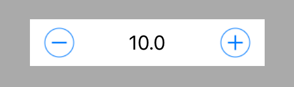
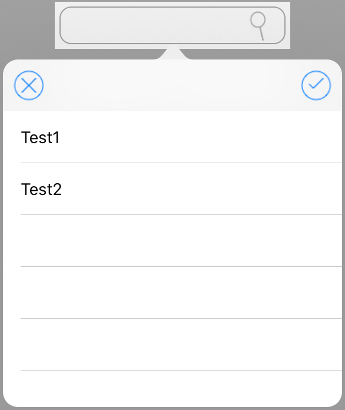

# parts-swift
object parts for swift

**Control Object**
---

## SHStepper

SHStepper is simple object.



### Usage

Add file "SHStepper.swift" to your project.

Object define.

```Swift
    let stepper = SHStepper()
```

Setup object and add to View or SubView

```Swift
    override func viewDidLoad() {
        super.viewDidLoad()
        // Do any additional setup after loading the view.
        self.view.backgroundColor = UIColor.lightGray

        stepper.minimumValue = 1
        stepper.maximumValue = 100
        stepper.value = 50
        stepper.stepValue = 1
        stepper.buttonSize = 30
        stepper.viewMargin = UIEdgeInsets(top: 0, left: 10, bottom: 0, right: 10)
        self.view.addSubview(stepper)

    }
```

Update object size and position

```Swift
    override func viewDidLayoutSubviews() {
        super.viewDidLayoutSubviews()
        stepper.frame.size = CGSize(width: 200, height: 40)
        stepper.center = CGPoint(x: self.view.bounds.width / 2, y: self.view.bounds.height / 2)

    }
```

## SHSelector



### Usage

Add file "SHSelector.swift" to your project.

Setup object and add to View or SubView

```Swift
    override func viewDidLoad() {
        super.viewDidLoad()
        // Do any additional setup after loading the view.
        self.view.backgroundColor = UIColor.lightGray

        selector = SHSelector(parent: self)
        selector.searchImageOn = true
        selector.backgroundColor = UIColor.white
        selector.items = ["Test1","Test2"]
        selector.popupButtonSize = 30
        self.view.addSubview(selector)
    }
```

Update object size and position

```Swift
    override func viewDidLayoutSubviews() {
        super.viewDidLayoutSubviews()
        selector.frame.size = CGSize(width: 200, height: 40)
        selector.center = CGPoint(x: self.view.bounds.width / 2, y: self.view.bounds.height / 2)
    }
```

